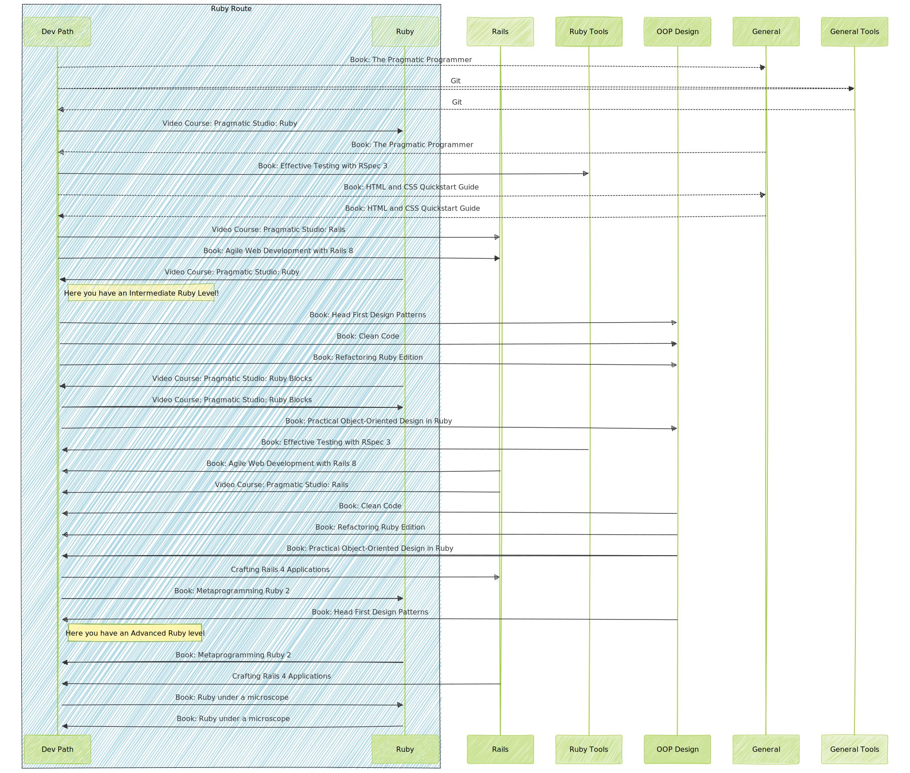

# ruby_learning_path

This repository contains a diagram generated to explain the learning path for Ruby programming language.

The diagram was described in a talk for the communities: [@oaxacarb](https://github.com/oaxacarb) and [@oaxacoders](https://github.com/oaxacoders).

Slides as reference (Spanish): [Ruby: Ruta de aprendizaje. De básico a avanzado](https://docs.google.com/presentation/d/1EKWlTLFVOVQSNadEB4QxLoj3B2sVT_fxoEbYOW_CqBs/edit?usp=sharing)

The diagram is in Spanish, and the slides too.

## Diagram 

The diagram was generated using [mermaid](https://mermaid-js.github.io/mermaid/#/).

The source code for the diagram is in the `ruby_learning_path.mmd` file.

